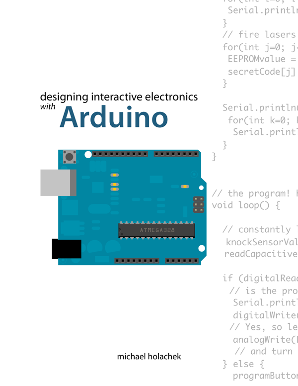

----------
Designing Interactive Electronics with Arduino
=======
This git repository holds all the code for Mr. Lindsay's Digital Electronics Arduino unit. If you can't figure out how something works or want to peek ahead to the next chapter, this will try to help. Try to figure it out on your own first, then if you're stumped, come here to find out why it's not working.

